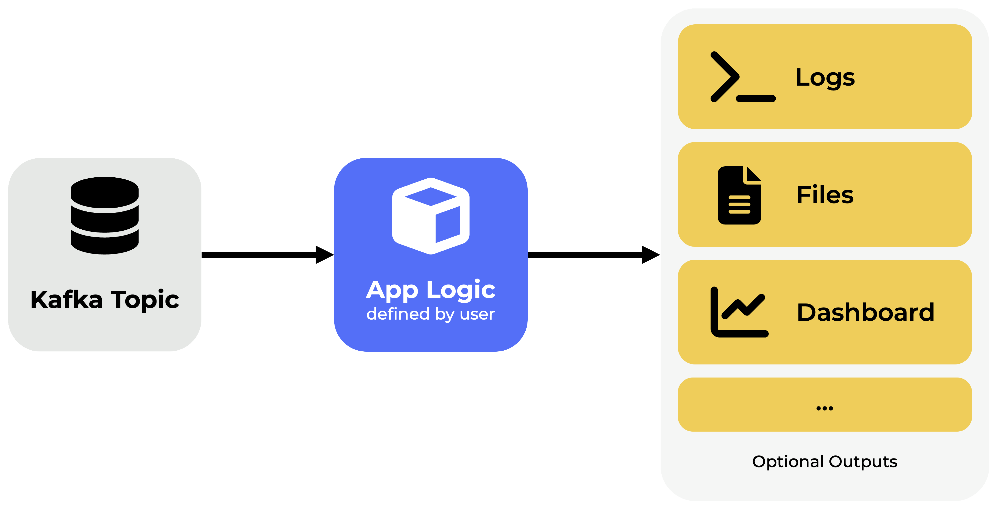

<picture>
  <source media="(prefers-color-scheme: dark)" srcset="assets/mf-logo-light.png">
  <source media="(prefers-color-scheme: light)" srcset="assets/mf-logo.png">
  
</picture>

# ℹ️ What is MultiFlow?

**MultiFlow** is a tool built to simulate **real-time industrial data streams**, allowing developers and researchers to test machine learning algorithms in a **controlled and risk-free environment**.  
Instead of waiting for unpredictable real-world data — or risking disruptions in live systems — MultiFlow provides a virtual space to **prototype, validate, and fine-tune** ML solutions with realistic streaming behavior.

By mimicking operational conditions without the actual risks, MultiFlow helps streamline the **optimization of industrial processes** while minimizing computational overhead and experimentation time.

## 🚀 Key Features

- **Stream any dataset** in real time with fully customizable parameters like lines-per-second or stream duration.
- **Start, pause, or replay** your simulations on demand — perfect for iterative testing.
- **Create and plug in custom Python algorithms ("Apps")** to consume the stream and generate live outputs.  
  *(Note: Apps must follow the MultiFlow structure and meet streaming compatibility requirements. See the [Apps Tutorial](#-apps-in-multiflow) for details.)*
- **Test multiple versions** of your Apps ("Instances") effortlessly — tweak parameters, switch input streams, and compare results.
- **Get real-time dashboards via Grafana** for each Instance, giving you immediate feedback on algorithm performance.  
  *(Note: Grafana setup is required before first use.)*
---

## 🛠️ Installation

To run MultiFlow locally, make sure you have the following installed:

* [Docker](https://www.docker.com/)
* [Node.js](https://nodejs.org/)

#### 1. Clone the Repository

Open a terminal and clone the repo:

```bash
git clone https://github.com/davidecarneiro/multiflow.git
```

#### 2. Install Node Dependencies

Navigate to the `app/` folder and install dependencies in the following subfolders:

```bash
cd multiflow/app
```

```
cd node
npm install
```

```
cd ../react-app
npm install
```

```
cd ../ws
npm install
```

#### 3. Start the Backend with Docker

In a **new terminal**, run:

```bash
docker compose up
```

> ⚠️ Make sure Docker is running in the background before you run this command.

This will pull and launch the required containers.

#### 4. Verify the Containers

Check that all containers are up and running. If any are failing, try restarting them or double-check if additional dependencies are needed.

#### 5. Start the Frontend (React)

The React frontend is **not yet containerized** to simplify development during active changes.
To launch it manually:

```bash
cd multiflow/app/react-app
npm start
```

This should open the app in your browser at `http://localhost:3000`.

##

🎉 You’re all set! Happy prototyping! 🤓
(And hey — if things feel confusing, check out the [Quick Start Guide](#-quick-start-guide) to get up to speed quickly.)

----

## 📦 Apps in MultiFlow

Apps in Multiflow are Python-based scripts that must have a specific structure, designed to handle specific streaming tasks, implemented in Faust. These can range from basic operations like data aggregation, filtering, or feature extraction, to more advanced algorithms such as detecting concept drift, identifying anomalies, or running machine learning models.

Every App follows a clean and modular structure:

1. **Import Required Libraries**

   * Typical imports include stream processing, machine learning, data manipulation, etc.

   ```python
   import faust
   import pandas as pd
   from influxdb_client import InfluxDBClient
   ```

2. **Set Configurations via Environment Variables**

   * These values are typically provided by the MultiFlow frontend/backend automatically and passed as environment variables.
   * You can still provide default values, which are used only if the frontend hasn't defined them:

   ```python
   APP_NAME = os.getenv('APP_NAME', 'MyApp')  # 'APP_NAME' comes from frontend; 'MyApp' is default fallback
   TOPIC_NAME = os.getenv('TOPIC_NAME', 'my_topic')
   ```

   * Examples of environment configs:
     * App name, topic name, port number
     * Output file name
     * InfluxDB connection data (optional)
     * Model parameters (batch size, threshold, etc.)

3. **Define Custom Parameters**

   * Use env variables or fixed values for:
     * How many samples to use
     * Batch size for analysis
     * Thresholds, time windows, etc.

    ```python
    THRESHOLD_VALUE = float(os.getenv('THRESHOLD', '0.9')) # 0.9 is the default threshold value;
    # THRESHOLD is the variable that receives the configured value
    ```

4. **App Initialization**

   * Set up Faust, connect to Kafka topic, configure any output databases or files.

   ```python
   app = faust.App(APP_NAME, broker='kafka://localhost:9092')
   topic = app.topic(TOPIC_NAME)
   ```

5. **Custom Logic Implementation**

   * The core of your App: what it does with each piece of data.
   * Could be a simple print or a complex model with feedback.

   ```python
   @app.agent(topic)
   async def process(stream):
       async for event in stream:
           print(event)
           # Do stats, ML, alerting...
   ```


6. **Optional Outputs**
   * Write results to:
     * **Logs** (for debugging or monitoring)
     * **Files** (e.g., CSVs)
     * **Databases** (e.g., InfluxDB)
     * **Alerts** (e.g., send notification or trigger some action)

##

Here's a simplified visual breakdown:



### Summary

Each App in MultiFlow follows a modular design. You define the logic; MultiFlow takes care of the plumbing — connecting topics, injecting config, managing deployment, and storing results. This makes it easy to reuse and remix logic across different data streams or use cases.

> 💡 Whether you're printing sensor values or detecting drift using a statistical test — you're always following the same structure. That's the power of Apps.

---

## ⚡ Quick Start Guide

#### 🧠 Quick Start Guide for MultiFlow

Welcome to the Quick Start Guide! Here you’ll (hopefully) learn how to get MultiFlow up and running for your first streaming experiment. In this example, we’ll focus on a classic problem in real-time data processing: **Anomaly Detection**.

But before we dive in...

#### ✅ Prerequisites:

* You’ve completed the [Installation Guide](#-installation-guide) without issues;
* All Docker containers are running and the MultiFlow interface is open in your browser;
* You have a beer 🍺 (or water if you’re under 18 or on the clock 🧃) and some peanuts 🥜.

### 📁 Step 1: Transforming a Dataset for Streaming

#### 🛠 Preparing the Data

First, grab the sample dataset [Labeled_Expanded.csv](https://raw.githubusercontent.com/davidecarneiro/multiflow/refs/heads/main/datasets/Labeled_Streaming.csv). Place it in the `datasets` folder under the root `multiflow` project directory.

Here’s a simple folder layout:

```
multiflow/
├── app/
├── datasets/ ← Put your dataset here
├── docker-compose.yml
├── grafana/
└── README.md
```

#### ➕ Adding the Project and Stream

Now open the MultiFlow web interface and follow these steps:

1. Navigate to the **Projects** tab.
2. Click **Add Project** in the top right.
3. Fill in the project info as you like (use our values if you're following the tutorial).
4. Once created, open the project and click **Add Stream**.
5. Again, fill out the form as you prefer, but **memorize the Stream Topic**. We’ll use `Labeled_Streaming` here.
6. Set `Data Source Type` to `File` and select `Labeled_Expanded.csv` as the `File Path`.
7. For `Playback Configuration`, choose `Lines per Second` and set it to `5`.
8. Click **Create**.


Boom! 🎉 You’ve got a stream ready to go.

---

### 🤖 Step 2: Creating the App

#### 🧪 The Idea

We’ll use an ensemble of Isolation Forests to detect anomalies in real-time. Don’t worry if that sounds complex—we’ll break it down.

#### 📄 Coding the App

You can either write your own Faust-compatible Python app or use our starter one (above) or available at [AnomalyDetection_EnsembleIsolationForest.py](https://raw.githubusercontent.com/davidecarneiro/multiflow/refs/heads/main/app/faust/code/AnomalyDetection_EnsembleIsolationForest.py). If you’re skipping ahead, jump to [Adding the App](#adding-the-app-and-instance).

This code consumes a Kafka stream with numerical features, builds an Isolation Forest ensemble model, flags anomalies, and streams the result to InfluxDB.

```
import faust
import os
import pandas as pd
from sklearn.ensemble import IsolationForest
from influxdb_client import InfluxDBClient, Point
from influxdb_client.client.write_api import SYNCHRONOUS

# === Config & Setup ===
InstanceName = os.getenv('Name', 'InstanceName')
InstancePort = os.getenv('Port', '6066')
StreamTopic = os.getenv('StreamTopic', 'phd_kafka')
influxdb_url = os.getenv('INFLUXDB_URL', 'http://influxdb_server:8086')
influxdb_token = os.getenv('INFLUXDB_TOKEN', 'admin')
influxdb_org = os.getenv('INFLUXDB_ORG', 'multiflow')
influxdb_bucket = os.getenv('INFLUXDB_BUCKET', 'faust_app')

app = faust.App(InstanceName, broker='kafka_server://localhost:9092', web_port=int(InstancePort))
topic = app.topic(StreamTopic)
influx_client = InfluxDBClient(url=influxdb_url, token=influxdb_token, org=influxdb_org)
write_api = influx_client.write_api(write_options=SYNCHRONOUS)

# Fetching values for your Custom Fields
OutputFileName = os.getenv('OutputFileName', 'AnomalyDetection-Test') # 1st value comes from the frontend; 2nd value is a default value (in case your forget it)
CollectionName = os.getenv('CollectionName', 'AD-Labeled_Streaming')
initial_block_size = int(os.getenv('InitialBlockSize', '50'))
update_interval = int(os.getenv('UpdateInterval', '50'))

# Placeholder for data
received_data = pd.DataFrame()
isolation_forest_model = None

# Function to train or update the Isolation Forest model
def train_isolation_forest(dataframe, contamination=0.1):
    model = IsolationForest(n_estimators=100, max_samples='auto', contamination=contamination, random_state=42)
    model.fit(dataframe)
    return model

# Function to detect anomalies using the Isolation Forest model
def detect_anomalies(model, data):
    # Prediction: -1 indicates anomaly, 1 indicates normal
    scores = model.decision_function(data)
    predictions = model.predict(data)
    return scores, predictions

# Function to send data to InfluxDB
def send_to_influxdb(row_df, CollectionName):
    for _, row in row_df.iterrows():
        point = Point(CollectionName).tag("anomaly", row['anomaly'])
        for column in row.index:
            if column != 'anomaly':
                point = point.field(column, float(row[column]))
        write_api.write(bucket=influxdb_bucket, record=point)
        print(f"Data point written to InfluxDB: {row.to_dict()}")

# Faust agent to process messages and detect anomalies
@app.agent(topic)
async def anomaly_detection_agent(stream):
    global received_data, isolation_forest_model

    row_count = 0
    numeric_columns = None

    async for event in stream:
        # Parsing the incoming event to create a DataFrame row
        csv_data = event.get('csv_data', '')
        try:
            row_values = list(map(float, csv_data.split(',')))
            num_columns = len(row_values)
            column_names = [f'col{i+1}' for i in range(num_columns)]
            row_df = pd.DataFrame([row_values], columns=column_names)
            print("Parsed DataFrame row:", row_df)
        except ValueError:
            print(f"Skipping event due to parsing error: {csv_data}")
            continue

        # Initializing columns and training initial Isolation Forest model
        if numeric_columns is None:
            numeric_columns = row_df.select_dtypes(include='number').columns.tolist()
            initial_data = pd.concat([received_data, row_df]).head(initial_block_size)
            isolation_forest_model = train_isolation_forest(initial_data[numeric_columns])
            print("Initial Isolation Forest model trained.")

        # Ensuring numeric column consistency
        row_df = row_df[numeric_columns]

        # Detecting anomalies
        scores, predictions = detect_anomalies(isolation_forest_model, row_df)
        row_df['scores'] = scores
        row_df['anomaly'] = ['yes' if pred == -1 else 'no' for pred in predictions]
        
        # Appending row to received data and update row count
        received_data = pd.concat([received_data, row_df], ignore_index=True)
        row_count += 1

        # Sending data to InfluxDB
        send_to_influxdb(row_df, CollectionName=CollectionName)

        # Periodically updating the Isolation Forest model every `update_interval` rows
        if row_count % update_interval == 0:
            recent_data = received_data[numeric_columns].iloc[-initial_block_size:]
            isolation_forest_model = train_isolation_forest(recent_data)
            print(f"Isolation Forest model updated after {row_count} rows.")

        # Saving to CSV in batches of 100 rows
        if row_count % 100 == 0:
            received_data.to_csv(f"{OutputFileName}.csv", index=False)
            print("CSV file updated with latest events.")

# Entry point for the application
if __name__ == '__main__':
    app.main()
```
This script is great for getting started quickly with streaming anomaly detection. It's fully compatible with the visualization setup described above!

#### 🧩 Adding the App and Instance

1. Go to the **Apps** tab.
2. Click **Add App**.
3. Fill out the form and upload the Python file (e.g., `AnomalyDetection_EnsembleIsolationForest.py`).
4. Under `Custom Fields`, list each parameter your Python file requires:

   * Set the **Name** to match the variable in your Python code.
   * Choose the appropriate **Type** (number, string, etc.).
5. Once done, click **Create**.
6. Open the new App, and click **Add Instance**.
7. Give it a name and pick a **unique port** that isn’t used.
8. Select the correct **Stream Topic** (e.g., `Labeled_Streaming`).
9. Provide values for the **Custom Fields** you defined earlier.
10. Click **Create**.


Your app is now ready to consume data! 💻

---

### 📊 Step 3: Setting up Grafana

#### 🔌 Logging In & Connecting InfluxDB

Let’s wire Grafana to the data source:

1. Visit `http://localhost:3002/`.
2. Login:

   * Username: `admin`
   * Password: `admin`
3. Go to **Connections > Data Sources**.
4. Check if `influxdb` is listed. If not:

   * Click **Add new data source**
   * Choose **InfluxDB**
   * Set **Query Language** to `Flux`
   * Set **URL** to `http://influxdb_server:8086`
   * Under **InfluxDB Details**, set "Organization" to `multiflow`
   * Click **Save & Test**

#### 📈 Adding Your Chart

1. Go to **Dashboards** > **New Dashboard**.
2. Click **Add Visualization** and select the `influxdb` source.
3. Use **Query A** to pull all data.
4. Use **Query B** to pull only flagged anomalies.

As you might have noticed, we use two different Flux queries here. This separation improves visualization clarity by letting us style anomalies differently (e.g., red dots or lines), without modifying the original data structure.

##

### 🔹 Query A: Pull All Data

This query loads all the relevant measurements (`col1` to `col5`) from the selected time range.

```flux
from(bucket: "faust_app")
  |> range(start: v.timeRangeStart, stop: v.timeRangeStop)
  |> filter(fn: (r) => r["_measurement"] == "AD-Labeled_Streaming")
  // Keep only the fields of interest
  |> filter(fn: (r) => r["_field"] == "col1" or r["_field"] == "col2" or r["_field"] == "col3" or r["_field"] == "col4" or r["_field"] == "col5")
  // Rename fields to readable labels for the chart
  |> map(fn: (r) => ({
        _value: r._value,
        _time: r._time,
        _field: if r._field == "col1" then "InjectionTime" else
                if r._field == "col2" then "PlastificationTime" else
                if r._field == "col3" then "CycleTime" else
                if r._field == "col4" then "Pillow" else
                if r._field == "col5" then "MaxPressure" else r._field
    }))
```
##

### 🔹 Query B: Pull Only Anomalies

This query is similar to Query A, but it filters rows where `anomaly == "yes"` (if you are using "yes" as label in your App), showing only flagged data points.

```flux
from(bucket: "faust_app")
  |> range(start: v.timeRangeStart, stop: v.timeRangeStop)
  |> filter(fn: (r) => r["_measurement"] == "AD-Labeled_Streaming")
  // Keep only the fields of interest
  |> filter(fn: (r) => r["_field"] == "col1" or r["_field"] == "col2" or r["_field"] == "col3" or r["_field"] == "col4" or r["_field"] == "col5")
  // Keep only anomalies
  |> filter(fn: (r) => r["anomaly"] == "yes")
  // Rename all fields to just "Anomaly" for consistent styling
  |> map(fn: (r) => ({
        _value: r._value,
        _time: r._time,
        _field: "Anomaly"
    }))
```

> 💡 By renaming all anomaly fields to the same label ("Anomaly"), you can style them collectively in Grafana (e.g., red color, different shape).

##


Customize the chart however you want—it’s all Grafana from here 😎.

---

### 🚀 Step 4: Running the Pipeline

#### ▶️ Starting the Instance

1. Go to **Apps** and open your app.
2. Click the toggle button next to your instance.
3. Wait for `Worker ready` in the logs before continuing.

> Tip: You’ll find quick access to active instances in the side menu.

#### 🔁 Starting the Stream

1. Go to the **Projects** page.
2. Find your project and click the **Play** button.
3. You’ll see progress based on your configured stream speed.

> You can also access active streams quickly from the side menu.

#### 👀 Viewing the Results

Your data is now being processed! Check:

* **Grafana Dashboards** for live charts;
* **Local output files**, depending on your app’s config.

> Having issues? Check the Faust logs on the instance details page.


### 🎉 Conclusion

We hope this guide helped you get started with MultiFlow. Try out different use cases, plug in your own apps, and see how far you can push your stream simulations.

Happy hacking! 💻✨

---

## Acknowledgments

This work has been supported by the European Union under the Next Generation EU, through a grant of the Portuguese Republic's Recovery and Resilience Plan (PRR) Partnership Agreement, within the scope of the project PRODUTECH R3 – "Agenda Mobilizadora da Fileira das Tecnologias de Produção para a Reindustrialização", Total project investment: 166.988.013,71 Euros; Total Grant: 97.111.730,27 Euros. 
